# Authentik OIDC Integration with Umami

This guide walks you through setting up Authentik as an OIDC identity provider for Umami.

## Prerequisites

- Authentik instance running and accessible
- Umami instance with OIDC support configured (see [Configuration Guide](../configuration.md))
- Admin access to both systems

---

## Part 1: Configure Authentik

### Step 1: Create a New Application

1. Log in to your Authentik admin interface
2. Navigate to **Applications** → **Applications**
3. Click **Create** button

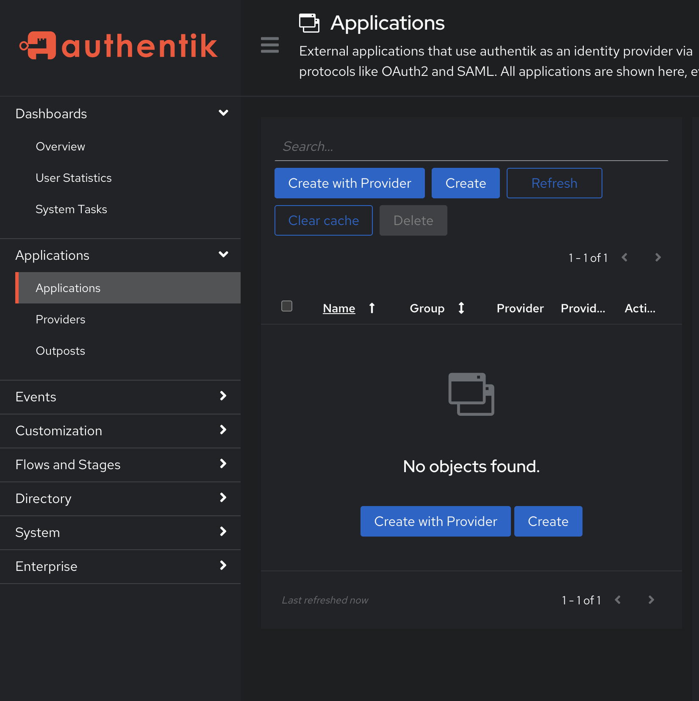

You'll see two options for creating an application:

---

## 🔀 Choose Your Setup Method

Authentik offers two approaches for creating applications. Choose the one that fits your workflow:

### Option A: With Provider (Recommended - Guided Wizard)

**Best for:** First-time setup, new applications

**Workflow:** Multi-step guided process (images 2-6 below) that creates both application and provider together.

**Advantages:**
- ✅ Everything configured in one workflow
- ✅ Step-by-step guidance through all settings
- ✅ No manual pairing needed
- ✅ Less chance of misconfiguration

**Steps:** Follow Steps 2-6 below (this guide's primary path)

### Option B: Simple Application (Advanced)

**Best for:** Reusing existing providers, manual control

**Workflow:** Single-page form (image 7 below) that creates just the application - you manually create and pair the provider afterward.

**Advantages:**
- ℹ️ Faster if you already have a provider
- ℹ️ More flexibility to reuse providers across applications
- ℹ️ Can configure application UI settings before linking provider

**Use when:**
- You already have an OAuth2/OIDC provider configured
- You want to configure multiple applications with the same provider
- You prefer manual control over the linking process

<details>
<summary><strong>Click here to view Option B: Simple Application workflow</strong></summary>

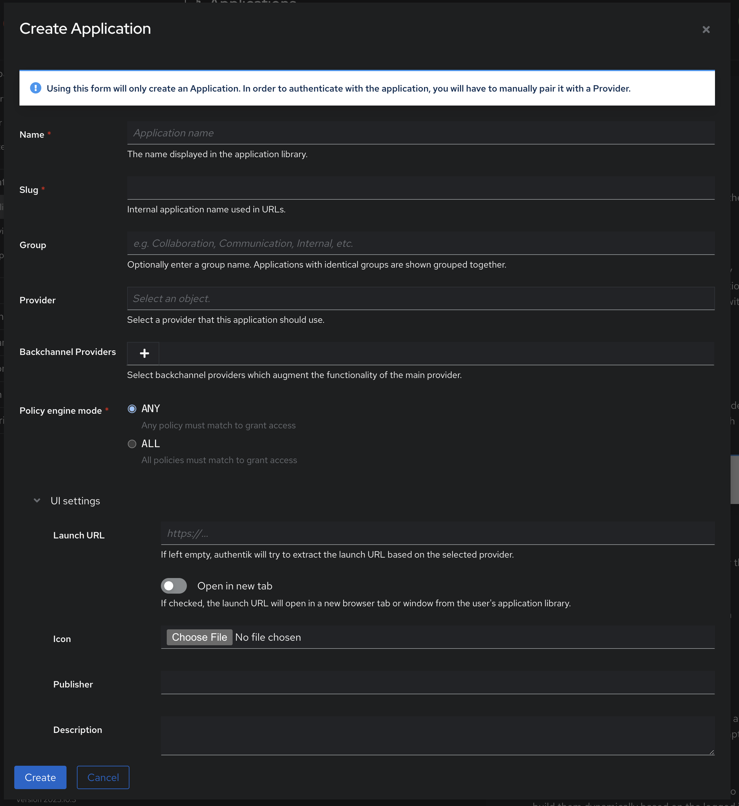

#### Fields:

| Field | Value | Purpose |
|-------|-------|---------|
| **Name** | `Umami` | Display name users see |
| **Slug** | `umami` | URL-safe identifier |
| **Group** | (Optional) | Organize apps by category |
| **Provider** | Leave blank | You'll create and link it separately |
| **Launch URL** | `https://analytics.example.com` | Where users go when clicking the app |
| **Open in new tab** | ☑️ Checked | Opens in new browser tab |
| **Icon** | Upload PNG/SVG | Visual icon for app library |

After creating the simple application:
1. Navigate to **Applications** → **Providers**
2. Click **Create** → **OAuth2/OpenID Provider**
3. Configure the provider (similar to Steps 4-5 below)
4. Go back to **Applications** → **Applications** → `Umami`
5. Edit the application and select your newly created provider

</details>

---

**This guide follows Option A (With Provider)** for a complete, guided experience.

---

### Step 2: Application Settings (Option A: With Provider)

Fill in the following fields:

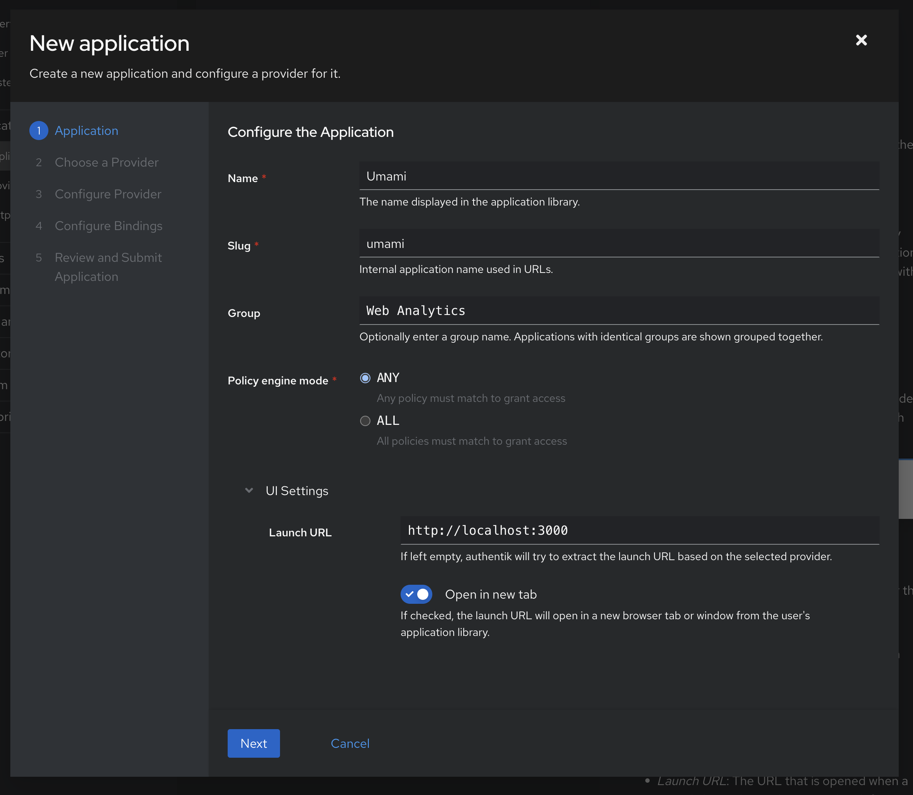

| Field | Value | Description | Impact |
|-------|-------|-------------|--------|
| **Name** | `Umami` | The name displayed in the application library | What users see when browsing applications in Authentik |
| **Slug** | `umami` | Internal application name used in URLs (lowercase, no spaces) | Becomes part of OIDC URLs: `/application/o/umami/` |
| **Group** | (Optional) | Groups applications together in the library | Organizational only - helps categorize apps in Authentik UI |
| **Provider** | Create a new provider | We'll configure this in the next step | Links this application to an OAuth2/OIDC provider |
| **Policy engine mode** | `any` | Controls how policies are evaluated | `any` = passes if any policy passes (recommended for most cases) |
| **UI Settings** | Leave blank or customize | Launch URL, icon, description, publisher | Can be configured later - controls how app appears in user portal |

> **Important:** The **Launch URL** can be configured later in the application's UI settings if needed.
>
> **Examples:**
> - Development: `http://localhost:3000`
> - Production: `https://analytics.example.com`

Click **Create** to continue.

---

### Step 3: Choose Provider Type

Select **OAuth2/OpenID Provider** from the provider types list.

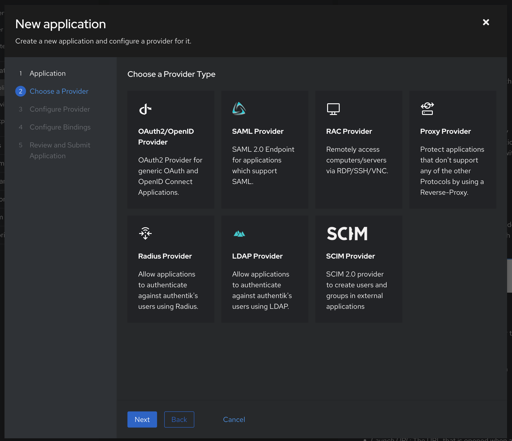

Click **Next** to continue.

---

## 📝 Quick Reference: URLs Summary

Before proceeding, here's a quick reference for the URLs you'll need:

| Setting | Purpose | Example (Development) | Example (Production) |
|---------|---------|----------------------|---------------------|
| **Redirect URI** (Authentik) | OAuth callback endpoint | `http://localhost:3000/api/auth/callback/authentik` | `https://analytics.example.com/api/auth/callback/authentik` |
| **OIDC Issuer** (Umami) | Authentik OIDC provider URL | `https://auth.example.com/application/o/umami/` | `https://auth.example.com/application/o/umami/` |
| **Authorization URL** (Optional) | Custom auth endpoint | `https://auth.example.com/application/o/authorize/` | `https://auth.example.com/application/o/authorize/` |
| **Token URL** (Optional) | Custom token endpoint | `https://auth.example.com/application/o/token/` | `https://auth.example.com/application/o/token/` |
| **Userinfo URL** (Optional) | Custom userinfo endpoint | `https://auth.example.com/application/o/userinfo/` | `https://auth.example.com/application/o/userinfo/` |

> **Note:** The optional URLs are auto-discovered from the issuer URL, so you typically don't need to configure them explicitly.

---

### Step 4: Configure OAuth2/OIDC Provider

Fill in the provider configuration across multiple tabs:

#### Protocol Settings

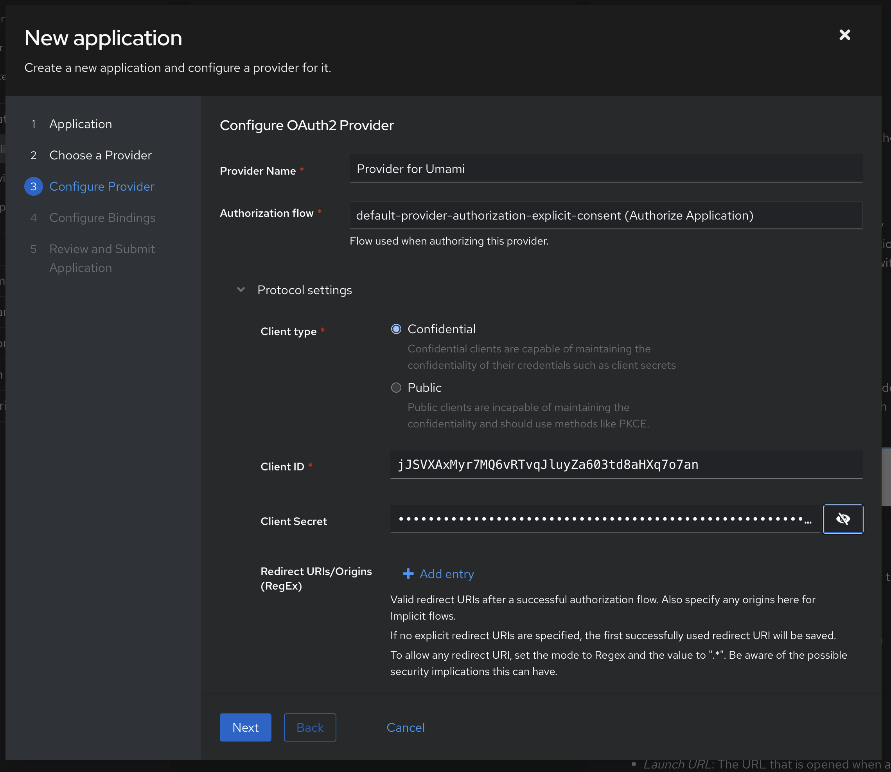

| Field | Value | Purpose | Why It Matters |
|-------|-------|---------|----------------|
| **Name** | `umami` | Provider identifier | Matches application slug - keeps configuration organized |
| **Protocol** | `OAuth2/OpenID Connect` | Authentication protocol | Already selected from Step 3 - enables OIDC features |

All other protocol settings are configured in subsequent tabs (see below).

#### Redirect URIs / Origins

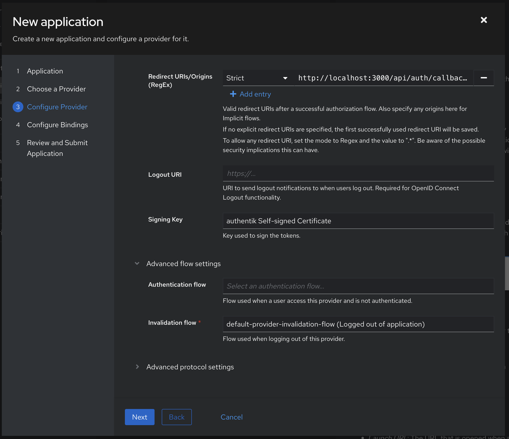

Add the OAuth callback endpoint (replace `analytics.example.com` with your domain):

**Redirect URIs:**
```
https://analytics.example.com/api/auth/callback/authentik
```

Or for development:
```
http://localhost:3000/api/auth/callback/authentik
```

> **Important:** The callback URI format is: `{UMAMI_URL}/api/auth/callback/authentik`
>
> The last segment `authentik` must match the provider ID you configured in Umami.
>
> For localhost, you may need both `http://localhost:3000/...` and `http://127.0.0.1:3000/...`

**Redirect URI Matching:**

| Field | Recommended Value | Why |
|-------|-------------------|-----|
| **Redirect URI matching** | `Strict` | **Use Strict, not Regex.** Regex is a security risk — it can allow unintended redirect targets if your pattern is loose. Strict means only the exact URL above is allowed. |

**Logout URI:**

| Field | Recommended Value | Purpose |
|-------|-------------------|---------|
| **Logout URI** | `https://analytics.example.com/login` | Where Authentik redirects users **after** logout completes |

> **💡 What the Logout URI Actually Does:**
>
> This is **NOT** a back-channel endpoint. When Umami initiates logout, this is the full flow:
>
> ```
> 1. User clicks logout in Umami
>         ↓
> 2. Umami clears its JWT session cookie
>         ↓
> 3. Umami redirects to Authentik's end_session endpoint:
>    https://auth.example.com/application/o/umami/end-session/
>    ?id_token_hint=<token>
>    &post_logout_redirect_uri=https://analytics.example.com/login
>         ↓
> 4. Authentik invalidates its SSO session
>         ↓
> 5. Authentik redirects back to the Logout URI (your login page)
> ```
>
> **Result:** User is logged out from both Umami and Authentik completely. If they log in again, Authentik will prompt for credentials.
>
> **Without this:** User ends up on a blank Authentik page after logging out.

**Recommended value:** `https://analytics.example.com/login` (or `http://localhost:3000/login` for dev)

---

#### Quick Reference: Redirect URIs Configuration Summary

| Field | Value | Required? | Security Note |
|-------|-------|-----------|---------------|
| **Redirect URI** | `https://umami.yourdomain.com/api/auth/callback/authentik` | ✅ Yes | Must match provider ID in Umami |
| **Redirect URI mode** | `Strict` | ✅ Yes | **Never use Regex** — security risk! |
| **Logout URI** | `https://umami.yourdomain.com/login` | ✅ Yes (for SSO logout) | Where Authentik redirects after logout |
| **Signing Key** | `authentik Self-signed Certificate` | ✅ Yes | Default is fine — Umami verifies via JWKS |

> **💡 The `authentik` segment in the callback URL must match your Umami provider ID.** If you named it `my-authentik` in Umami, use `/callback/my-authentik`.

---

**Signing Key:**

| Field | Value | Purpose | Why It Matters |
|-------|-------|---------|----------------|
| **Signing Key** | `authentik Self-signed Certificate` | Used to sign JWT access/ID tokens | Umami verifies tokens using Authentik's JWKS endpoint - default self-signed cert works perfectly |

> **Note:** You can create a custom certificate in Authentik's **System → Certificates** if you need specific key requirements, but the self-signed certificate works perfectly for OIDC.

**Flows:**

| Field | Recommended Value | Purpose | Customization Options |
|-------|-------------------|---------|----------------------|
| **Authentication flow** | `default-authentication-flow` | How users authenticate (login screen) | Customize in **Flows & Stages** to add MFA, password policies, custom branding |
| **Authorization flow** | `default-provider-authorization-explicit-consent` | User consent screen behavior | `explicit-consent` = users see permission screen, `implicit` = auto-approve (faster but less transparent) |
| **Invalidation flow** | `default-provider-invalidation-flow` | Handles logout/session cleanup | Customize to revoke tokens, clear sessions, or redirect specific locations |

> **Tip:** These default flows work well for most use cases. Customize them in **Flows & Stages** if you need specific authentication requirements (e.g., MFA, terms acceptance, custom login branding).

#### Scopes

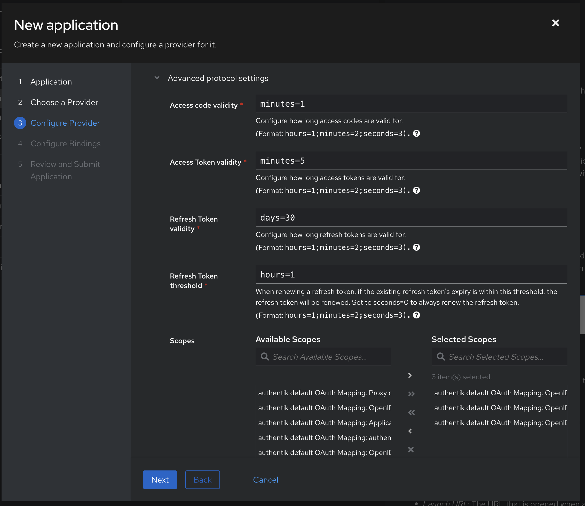

Move these scopes from "Available Scopes" to "Selected Scopes":

| Scope | Required? | Provides | Impact |
|-------|-----------|----------|--------|
| **openid** | ✅ Yes | Core OIDC functionality | Without this, authentication fails - absolutely required |
| **email** | ✅ Yes | User email address | Umami uses email as unique identifier - required for user creation |
| **profile** | ✅ Yes | User name, avatar, metadata | Required for displaying user information in Umami |
| **groups** | 🔧 For role/team mapping | User group memberships | Required for automatic role mapping and team sync (see Step 5) |

> **Note:** The `groups` scope requires custom property mapping configuration (see Step 5 below).

#### Advanced Protocol Settings

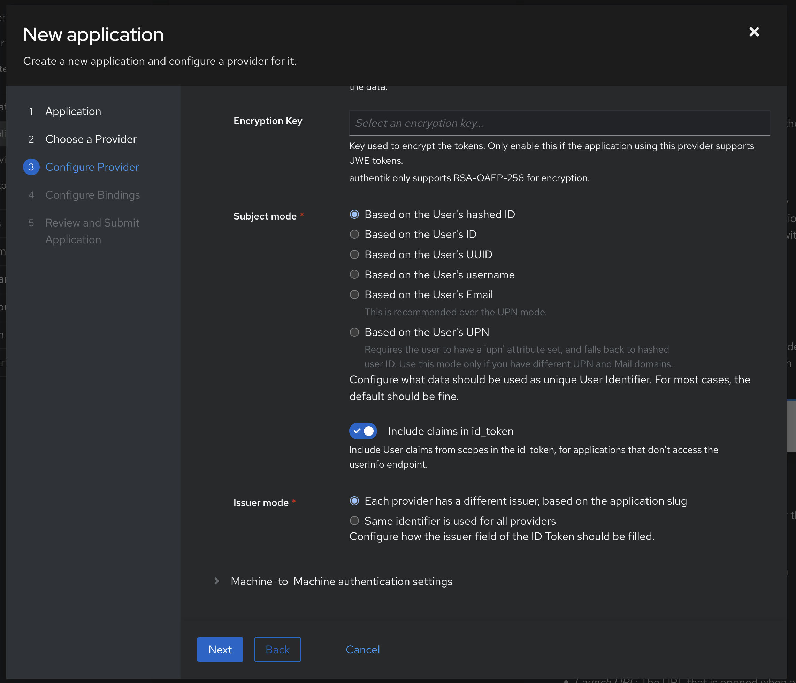

Configure the client credentials and token lifetimes:

| Field | Value | Purpose | Impact |
|-------|-------|---------|--------|
| **Client type** | `Confidential` | Requires client secret for authentication | Server-side apps should use Confidential - more secure than Public (which has no secret) |
| **Client ID** | (auto-generated) | Unique identifier for this OAuth2 client | Copy this - you'll need it for `AUTH_AUTHENTIK_ID` in Umami env vars |
| **Client Secret** | (auto-generated) | Secret key for server-to-server authentication | Copy this - you'll need it for `AUTH_AUTHENTIK_SECRET` in Umami env vars |
| **Access code validity** | `minutes=1` | How long authorization codes are valid | Short-lived (1 min) is secure - codes are immediately exchanged for tokens |
| **Access token validity** | `minutes=5` | How long access tokens are valid before expiring | Short-lived tokens are more secure but may require more refreshes |
| **Refresh token validity** | `days=30` | How long users stay logged in before re-authentication | Balance security vs UX - 30 days is reasonable for analytics tools |

> **Security Note:** Keep `Confidential` client type in production. Never expose the client secret in browser JavaScript - Auth.js handles this server-side.

#### Token Settings

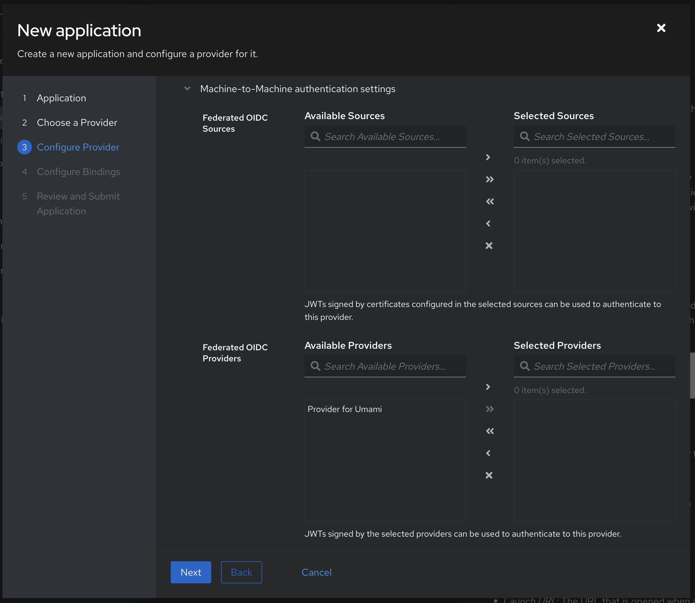

Review the token settings. The defaults are appropriate for most use cases.

> ⚠️ **Important:** Copy both the **Client ID** and **Client Secret** now. You'll need these when configuring Umami.

Click **Finish** to create the provider.

---

### Step 5: Configure Property Mappings for Groups (Optional)

To use Umami's role mapping and team sync features, you need to include the `groups` claim.

**Option 1: Use the built-in groups scope (if available)**

Some Authentik versions include a default `goauthentik.io/providers/oauth2/scope-groups` scope mapping. If available, just add it to your provider's selected scopes.

**Option 2: Create a custom groups scope mapping**

1. Navigate to **Customisation** → **Property Mappings**
2. Click **Create** → **Scope Mapping**
3. Configure:

| Field | Value |
|-------|-------|
| **Name** | `Umami Groups` |
| **Scope name** | `groups` |
| **Expression** | `return {"groups": [group.name for group in user.ak_groups.all()]}` |

4. Click **Save**
5. Go back to **Applications** → **Providers** → `umami`
6. Edit the provider and under **Scopes**, add the new `groups` scope to "Selected Scopes"

> **Note:** This step is only needed if you want to use role mapping (admin/view-only) or team synchronization features.

---

### Step 6: Configure Application Bindings (Optional)

Configure which users/groups can access this application:

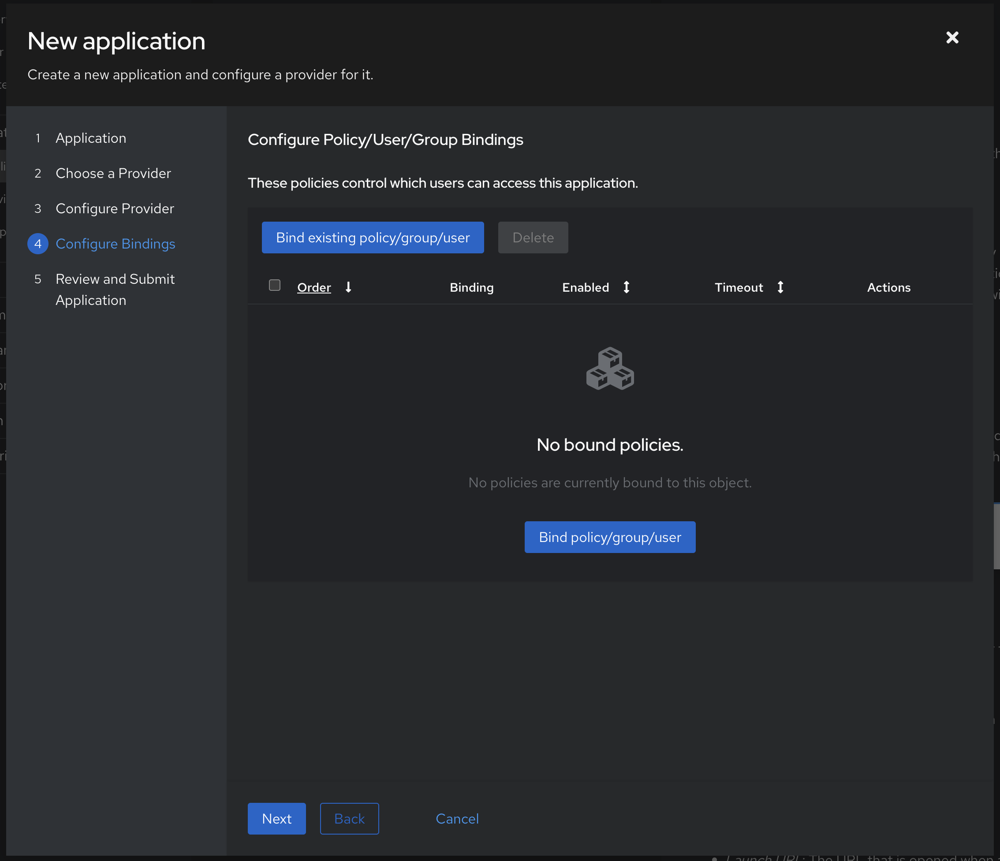

- **Default:** All users can access (no bindings needed)
- **Restricted:** Add specific User/Group bindings to limit access
- **Policy-based:** Add custom policies for advanced access control

---

### Step 7: Review and Submit

Review all your settings and click **Create** to finalize the application.

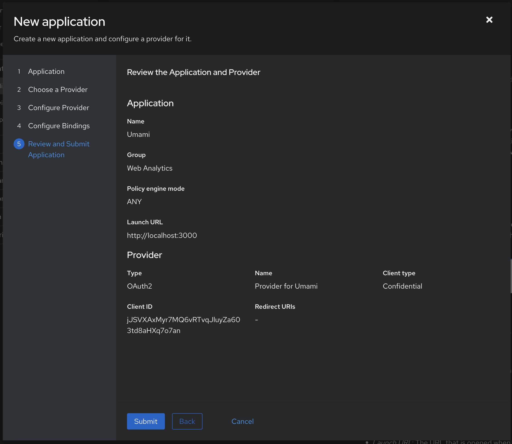

---

### Step 8: Get Provider Information

After creating the application, you need to gather the OIDC configuration details:

1. Navigate to **Applications** → **Providers**
2. Click on your `umami` provider
3. Note the following information:

**OIDC Issuer URL:**
```
https://auth.example.com/application/o/umami/
```

**Discovery Endpoint (to verify configuration):**
```
https://auth.example.com/application/o/umami/.well-known/openid-configuration
```

**Client ID and Secret:**
- Find these in the provider's settings (you should have copied them in Step 4)
- If you didn't copy the client secret, you can regenerate it

> **Tip:** You can verify your OIDC configuration by visiting the discovery endpoint in your browser. It should return a JSON document with all the OAuth/OIDC endpoints.

---

## Part 2: Create Groups for Role Mapping (Optional)

To use Umami's automatic role assignment via groups:

### Step 9: Create Groups in Authentik

1. Navigate to **Directory** → **Groups**
2. Click **Create** and create these groups:

| Group Name | Umami Role | Purpose |
|------------|------------|---------|
| `umami-admins` | Admin | Full system access |
| `umami-viewers` | View-only | Read-only access to all websites |

3. For team sync, create additional groups (e.g., `analytics-team`, `marketing-team`)

### Step 10: Assign Users to Groups

1. Navigate to **Directory** → **Users**
2. Select a user
3. Click **Groups** tab
4. Add user to groups (e.g., `umami-admins`)

---

## Part 3: Configure Umami

### Step 11: Set Environment Variables

Add to your `.env` file:

```bash
# Required for Auth.js
AUTH_URL=https://analytics.example.com
AUTH_SECRET=your-secret-key-min-32-chars

# Optional: Configure session duration (default: 24 hours)
SESSION_DURATION=86400

# Optional: Enable auto-create for new users
OIDC_AUTO_CREATE=true
```

**Generate AUTH_SECRET:**
```bash
openssl rand -base64 32
```

> **Note:** `AUTH_URL` should be the public-facing URL of your Umami instance.

---

### Step 12: Configure Provider (Two Options)

You can configure the Authentik provider either through environment variables or the admin UI.

#### Option A: Environment Variables (Quick Setup)

Add to your `.env` file:

```bash
# Authentik OIDC Provider
OIDC_NAME=Authentik
OIDC_ISSUER=https://auth.example.com/application/o/umami/
OIDC_CLIENT_ID=your-client-id-from-step-4
OIDC_CLIENT_SECRET=your-client-secret-from-step-4

# Optional: Explicit endpoint URLs (auto-discovered if not set)
OIDC_AUTH_URL=https://auth.example.com/application/o/authorize/
OIDC_TOKEN_URL=https://auth.example.com/application/o/token/
OIDC_USERINFO_URL=https://auth.example.com/application/o/userinfo/
```

**Replace:**
- `auth.example.com` with your Authentik domain
- `your-client-id-from-step-4` with the Client ID from Step 4
- `your-client-secret-from-step-4` with the Client Secret from Step 4

Restart Umami after updating the `.env` file.

#### Option B: Admin UI (Recommended for Multiple Providers)

1. Log in to Umami as admin
2. Navigate to **Settings** → **Providers**
3. Click **Add Provider**
4. Fill in the form:

| Field | Value |
|-------|-------|
| **Name** | `Authentik SSO` |
| **Type** | `oidc` |
| **Client ID** | (from Step 4) |
| **Client Secret** | (from Step 4) |
| **Issuer URL** | `https://auth.example.com/application/o/umami/` |
| **Scope** | `openid email profile groups` |
| **Trusted Provider** | ✓ Checked (Authentik verifies emails) |
| **Admin Group** | `umami-admins` (optional, from Step 9) |
| **View-Only Group** | `umami-viewers` (optional, from Step 9) |
| **Team Mappings** | See [Team Sync](#step-13-configure-team-sync-optional) below |

5. **Copy the Callback URI** shown in the form
6. Click **Save**

> **Note:** The callback URI shown is: `https://analytics.example.com/api/auth/callback/{provider-id}`
>
> **Important:** Verify this matches the Redirect URI you configured in Authentik (Step 4).

---

## Part 4: Role Mapping & Team Sync

Umami can automatically assign roles and team memberships based on Authentik group claims. Configure these in the **Role Mappings** tab when adding or editing the provider in Umami's admin UI.

### Understanding Umami Roles

| Role | Permissions |
|------|-------------|
| **Admin** | Full access: manage users, teams, websites, and providers |
| **View-only** | Read-only access to all websites and dashboards |
| **User** | Default role: can access websites they're assigned to |

### How It Works

On every login, Umami:
1. Reads the `groups` claim from the Authentik ID token
2. Checks if the user is in the **Admin Group** → assigns `role = admin`
3. Else checks if the user is in the **View-Only Group** → assigns `role = view-only`
4. Otherwise → assigns `role = user` (default)

**Priority:** Admin > View-only > User

> **Important:** Roles are re-evaluated on every login, so changes in Authentik groups take effect immediately on next login.

### Step 13: Configure Role Mapping

In Umami, edit the Authentik provider and go to the **Role Mappings** tab:

| Field | Value | Description |
|-------|-------|-------------|
| **Admin Group** | `umami-admins` | Authentik group name for admin users |
| **View-Only Group** | `umami-viewers` | Authentik group name for read-only users |

> **Note:** These must exactly match the group names created in Authentik (Step 9). Group matching is case-sensitive.

### Step 14: Configure Team Sync (Optional)

To automatically add users to Umami teams based on Authentik groups, use the **Team Mappings** field in the same **Role Mappings** tab:

1. Create teams in Umami (**Settings** → **Teams**)
2. Note each team ID (from URL: `/admin/teams/{team-id}`)
3. Enter **Team Mappings** as JSON:

```json
{
  "analytics-team": "abc123-team-id-uuid",
  "marketing-team": "def456-team-id-uuid"
}
```

**How it works:**
- **Key:** Authentik group name (from `groups` claim)
- **Value:** Umami team ID (UUID)
- User in Authentik group `analytics-team` → added to Umami team `abc123-...`
- User leaves Authentik group → removed from Umami team on next login
- Manual team memberships (`source: 'manual'`) are preserved (not removed by sync)

### Verifying Group Claims

To verify Authentik is sending the `groups` claim correctly:

1. Log in via Authentik
2. Decode the ID token at https://jwt.io
3. Look for the `groups` field:

```json
{
  "sub": "abc123",
  "email": "user@example.com",
  "groups": ["umami-admins", "analytics-team"]
}
```

If the `groups` claim is missing, ensure you completed Step 5 (Property Mappings for Groups).

---

## Part 5: Advanced Configuration

---

### Step 14: Configure Custom Token Lifetime (Optional)

In Authentik provider settings, adjust token lifetimes:

| Setting | Recommended |
|---------|-------------|
| **Access token validity** | `minutes=5` |
| **Refresh token validity** | `days=30` |

In Umami `.env`, control session duration:
```bash
SESSION_DURATION=7200  # 2 hours
```

---

### OIDC Logout Behavior

#### Full SSO Logout (Implemented) ✅

When users click "Logout" in Umami:

1. Umami clears its own JWT session cookie
2. Umami redirects to Authentik's `end_session_endpoint`:
   ```
   https://auth.example.com/application/o/umami/end-session/
   ?id_token_hint=<user_id_token>
   &post_logout_redirect_uri=https://analytics.example.com/login
   ```
3. Authentik terminates the SSO session
4. Authentik redirects user back to the **Logout URI** configured in provider settings (your Umami login page)

**Result:** User is logged out from **both** Umami and Authentik completely. Next login will require re-authentication.

#### Logout Flow Diagram

```
┌─────────────┐
│ User clicks │
│   Logout    │
└──────┬──────┘
       │
       ▼
┌──────────────────────────┐
│ Umami clears JWT cookie  │
└──────┬───────────────────┘
       │
       ▼
┌───────────────────────────────────────┐
│ Redirect to Authentik end_session:    │
│ /application/o/umami/end-session/     │
│ ?id_token_hint=<token>                │
│ &post_logout_redirect_uri=/login      │
└──────┬────────────────────────────────┘
       │
       ▼
┌────────────────────────────┐
│ Authentik invalidates      │
│ SSO session                │
└──────┬─────────────────────┘
       │
       ▼
┌────────────────────────────┐
│ Redirect to Logout URI:    │
│ https://analytics.../login │
└────────────────────────────┘
```

#### Credentials vs OIDC Logout

| Login Method | Logout Behavior |
|--------------|-----------------|
| **Local credentials** | Clears Umami session → redirects to login page |
| **OIDC (Authentik)** | Clears Umami session → logs out from Authentik → redirects to login page |

**Note:** If you log in with credentials (username/password), logout only clears the Umami session. OIDC logout is only triggered for users who logged in via SSO.

---

## Testing the Integration

### Test Login Flow

1. Log out of Umami
2. Navigate to Umami login page
3. Click **Sign in with Authentik SSO** button
4. Authenticate with Authentik → redirected back to Umami
5. ✅ You should be logged in

### Verify User Creation

1. Log in as admin → **Settings** → **Users**
2. Verify OIDC user was created with:
   - Email from Authentik
   - Correct role (based on group membership)

### Verify Role Mapping

1. Log in with a user in `umami-admins` group
2. Check **Settings** → **Users**
3. User should have **Admin** role

### Test Logout Flow (OIDC Single Logout)

1. Log in to Umami via Authentik SSO
2. Click the profile menu → **Logout**
3. ✅ You should be redirected to Authentik's logout page briefly
4. ✅ Then automatically redirected back to Umami's login page
5. ✅ Try logging in again — Authentik should prompt for credentials (not auto-login)

**Expected behavior:**
- Umami session is cleared
- Authentik SSO session is terminated
- User must re-authenticate on next login

**If Authentik auto-logs you in immediately:**
- Check that the Logout URI is configured correctly in Authentik provider settings
- Verify `id_token` is being stored in the session (check browser dev tools → Application → Cookies)

### Verify Team Sync

1. Log in with a user in a mapped group (e.g., `analytics-team`)
2. Go to **Settings** → **Teams** → click the team
3. User should appear in members list

### Check Audit Logs

1. Go to **Settings** → **Audit Logs**
2. Verify login event with:
   - Action: `login`
   - Provider: `authentik`
   - User email and IP address

---

## Troubleshooting

### "Invalid redirect_uri"

**Cause:** Redirect URI in Authentik doesn't match callback URL.

**Solution:**
1. Check Authentik provider → **Redirect URIs**
2. Should be: `https://analytics.example.com/api/auth/callback/authentik`
3. Ensure exact match (no trailing slash, correct protocol)

### "Email is required for login"

**Cause:** Email claim missing from ID token.

**Solution:**
1. Verify `email` scope is selected in Authentik provider
2. Check user has email address in Authentik
3. Test by decoding ID token at https://jwt.io

### Groups not working

**Cause:** Groups claim not present in ID token.

**Solution:**
1. Verify groups scope mapping created (Step 5)
2. Ensure `groups` scope added to provider
3. Verify user is in groups in Authentik
4. Check scope field in Umami includes `groups`

### "Can't reach authorization server"

**Cause:** Network connectivity or incorrect issuer URL.

**Solution:**
1. Verify Umami can reach Authentik instance
2. Check firewall rules
3. Test: `curl https://auth.example.com/application/o/umami/.well-known/openid-configuration`

### Login successful but no access

**Cause:** Authentik policies/bindings restricting access.

**Solution:**
1. Check Authentik application bindings
2. Verify user/group policies
3. Check user is in allowed groups

---

## Security Best Practices

### 1. Use HTTPS in Production

```bash
AUTH_URL=https://analytics.example.com  # Never http:// in production
```

### 2. Secure Client Secret

- Client secret is encrypted at rest in Umami (AES-256-GCM)
- Rotate secrets periodically in Authentik
- Update in Umami provider settings after rotation

### 3. Restrict Scopes

Only enable required scopes: `openid email profile groups`

### 4. Enable MFA in Authentik

1. **Flows & Stages** → **Stages**
2. Create TOTP/WebAuthn stage
3. Add to authentication flow
4. Require for admin users

### 5. Monitor Audit Logs

- Review Umami audit logs at `/admin/audit`
- Monitor Authentik event logs (Events → Logs)
- Set up alerts for failed login attempts

### 6. Use Trusted Flag Carefully

Only mark providers as "trusted" if Authentik verifies email addresses. This allows:
- Email verification bypass
- Automatic account linking for matching emails

### 7. Restrict Application Access

In Authentik, use bindings to limit which users/groups can access Umami.

---

## Known Limitations

### Back-Channel Logout Not Supported

**Limitation:** Umami currently only supports RP-initiated logout (front-channel). Back-channel logout initiated by Authentik is not implemented.

**Impact:** If a user is logged out of Authentik directly (e.g., admin terminates session), their Umami session remains active until they manually log out or the JWT expires.

**Workarounds:**
1. Use short JWT expiration times in Authentik (e.g., 5-15 minutes)
2. Educate users to log out of Umami explicitly
3. Implement session monitoring in Umami audit logs

### Groups Claim Requires Configuration

**Limitation:** Unlike some providers that include groups automatically, Authentik requires explicit scope mapping configuration to include the `groups` claim.

**Impact:** Without proper configuration (Step 5 in this guide), role mapping and team sync won't work.

**Workarounds:**
1. Follow the groups scope mapping setup (Step 5)
2. Verify groups claim in ID token using jwt.io
3. Alternative: Manually assign roles/teams in Umami

### Custom Claims Not Auto-Populated

**Limitation:** Authentik supports custom user attributes, but these aren't automatically included in ID tokens without explicit scope mappings.

**Impact:** If you need custom claims (e.g., `department`, `employeeId`), you must create additional scope mappings.

**Workarounds:**
1. Create custom property mappings in Authentik
2. Add scopes to provider configuration
3. Use Authentik's expression policies for dynamic claims

---

## Advanced: SSO-Only Mode

To disable local username/password login:

1. Configure OIDC provider in Umami
2. All users must authenticate via Authentik
3. Existing local accounts can still be linked to OIDC accounts by email

---

## Advanced: Multiple Authentik Providers

You can add multiple Authentik providers (e.g., dev vs prod):

1. Create separate applications in Authentik
2. Add each as a separate provider in Umami
3. Each appears as a distinct button on login page

---

## Next Steps

- **[Configuration Guide](../configuration.md)** - Learn about all configuration options
- **[Features](../features.md)** - Explore OIDC features (role mapping, team sync, audit logs)
- **Authentik Documentation:** https://goauthentik.io/docs/
