# Keycloak OIDC Integration with Umami

This guide walks you through configuring Keycloak as an OIDC identity provider for Umami.

## Prerequisites

- Keycloak instance running and accessible (version 18+)
- Admin access to Keycloak
- Umami instance with OIDC support configured (see [Configuration Guide](../configuration.md))
- Basic familiarity with Keycloak concepts (realms, clients, groups)

---

## Part 1: Create OIDC Client in Keycloak

### Step 1: Create a New Client

1. Log in to Keycloak admin console
2. Select your **Realm** (e.g., `master` or create a dedicated realm)
3. Navigate to **Clients** in the left sidebar
4. Click **Create client**

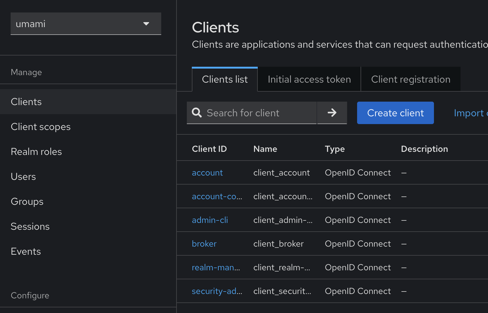

### Step 2: General Settings

| Field | Value | Description |
|-------|-------|-------------|
| **Client type** | `OpenID Connect` | OIDC protocol |
| **Client ID** | `umami` | Unique identifier (you'll use this in Umami) |

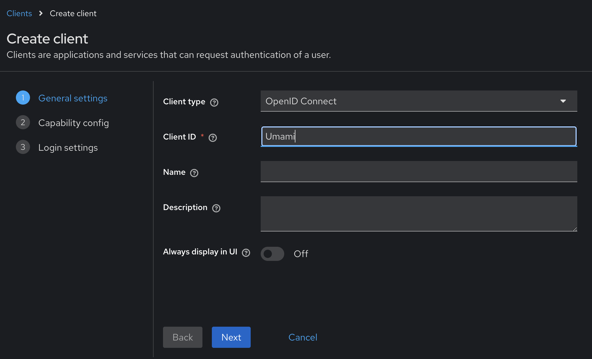

Click **Next**.

### Step 3: Capability Config

| Setting | Value |
|---------|-------|
| **Client authentication** | `ON` | Enables confidential client (requires client secret) |
| **Authorization** | `OFF` | Not needed for authentication |
| **Standard flow** | `✓ Enabled` | Authorization code flow |
| **Direct access grants** | `✗ Disabled` | Disable direct access (use standard flow) |
| **Implicit flow** | `✗ Disabled` | Not recommended for security |
| **Service accounts** | `✗ Disabled` | Not needed |

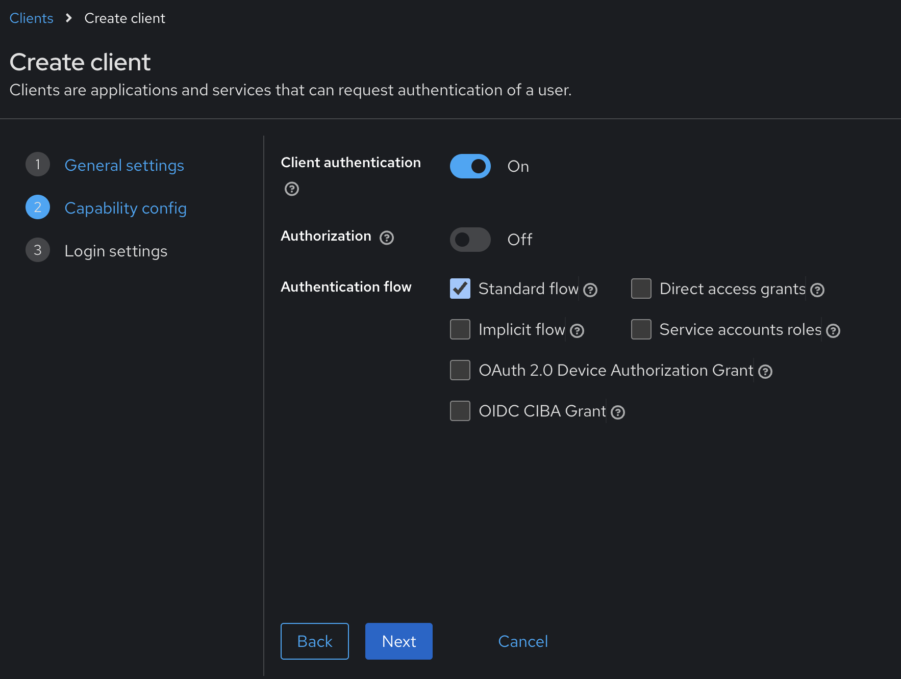

Click **Next**.

### Step 4: Login Settings

| Field | Value | Example |
|-------|-------|---------|
| **Root URL** | Umami homepage URL | `https://analytics.example.com` |
| **Home URL** | Same as root URL | `https://analytics.example.com` |
| **Valid redirect URIs** | Wildcard for now (we'll update later) | `https://analytics.example.com/api/auth/callback/*` |
| **Valid post logout redirect URIs** | Umami homepage | `https://analytics.example.com` |
| **Web origins** | Umami domain | `https://analytics.example.com` |

> **Important:** Replace `https://analytics.example.com` with your actual Umami URL. For local development, use `http://localhost:3000`.

> **Note:** We're using a wildcard (`/*`) for the redirect URI temporarily. After configuring the provider in Umami (Step 14), Umami will generate a provider ID, and we'll get the exact callback URL to update this setting (Step 15).

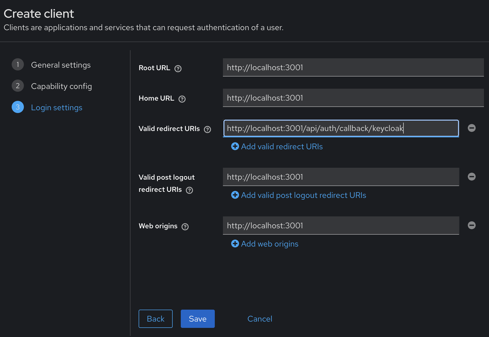

Click **Save**.

After saving, you should see your newly created client:

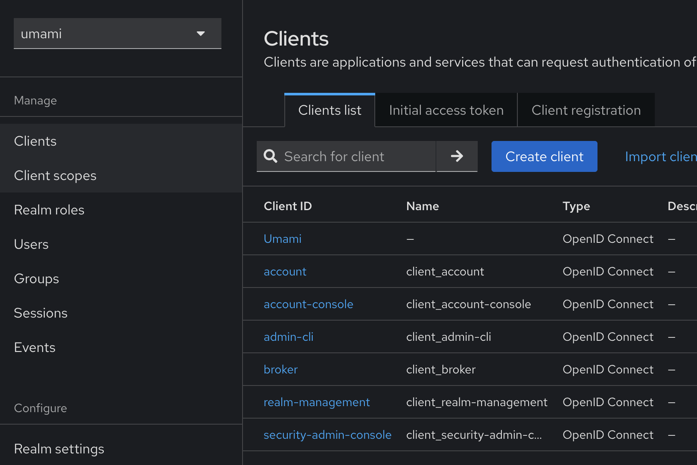

---

## Part 2: Configure Client Scopes

Client scopes define what information (claims) Keycloak includes in tokens. We need to configure:
- **Groups claim** - for role mapping (admin/view-only)
- **Email claim** - required for user identification
- **Profile claims** - for user display name

### Step 5: Navigate to Client Scopes

Starting from the Keycloak admin console:

1. In the left sidebar, click **Clients**
2. Click on your `umami` client (from the list)
3. Click the **Client scopes** tab at the top

You should see a screen showing **Assigned client scopes** and **Assigned optional client scopes**:

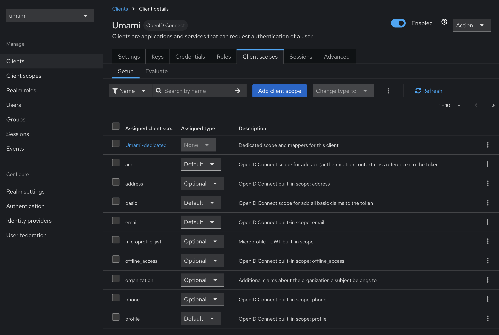

> **💡 What you're seeing:** This shows all the scopes that will be included when users log in. The important ones are:
> - `umami-dedicated` - Your custom scope for this client
> - `email` - Provides email address
> - `profile` - Provides name and username
> - Other default scopes (roles, web-origins, etc.)

---

### Step 6: Add Groups Claim to umami-dedicated Scope

Now we'll add a custom mapper to include group memberships in the token.

1. In the **Assigned client scopes** list (from the screen above), click on **`umami-dedicated`**

You'll see the scope configuration page:

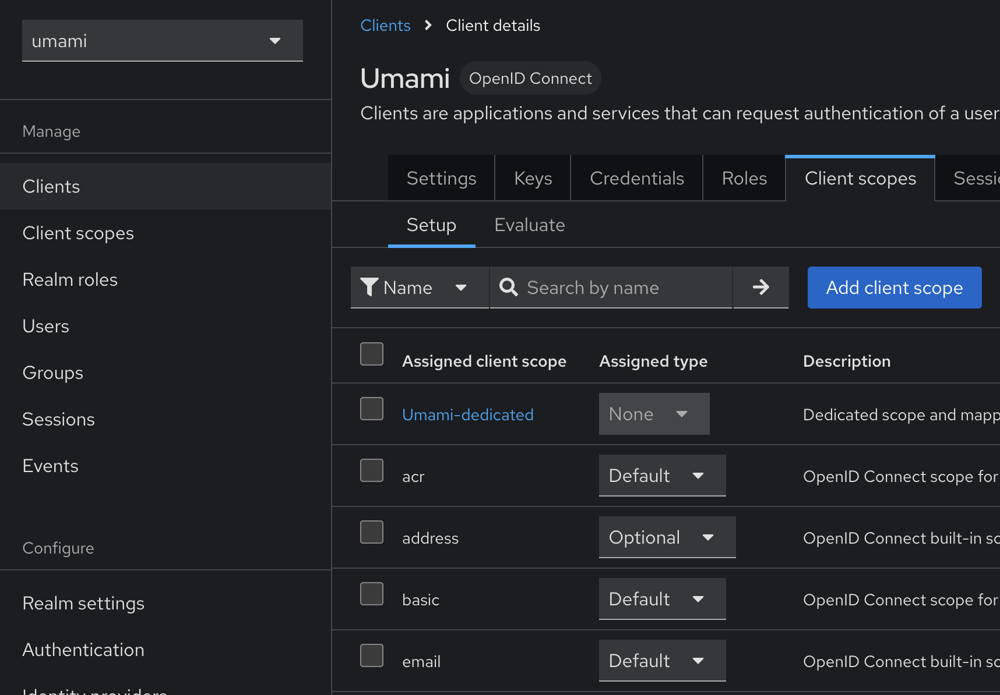

2. Click the **Mappers** tab (at the top of this page)
3. Click **Add mapper** button
4. Click **By configuration**

You'll see a list of mapper types:

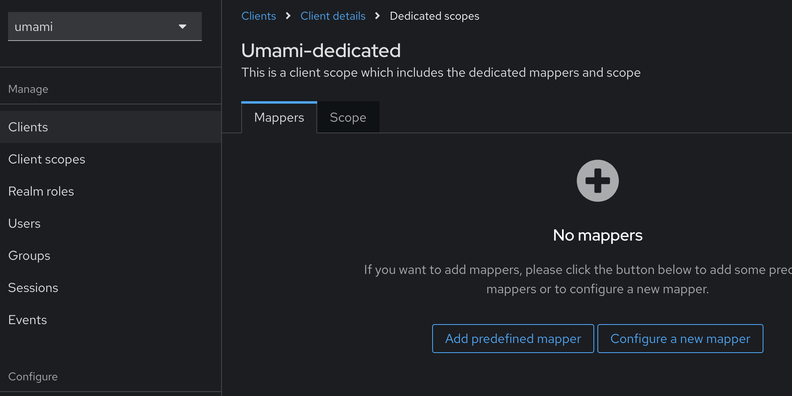

5. Scroll down and click **Group Membership**

You'll see the configuration options:

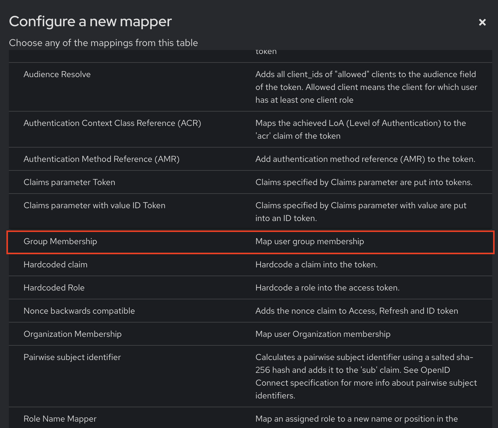

6. Fill in the mapper configuration:

| Field | Value | Description |
|-------|-------|-------------|
| **Name** | `groups` | Mapper name (can be anything, but `groups` is clear) |
| **Token Claim Name** | `groups` | The claim name in the JWT token - **must be `groups`** |
| **Full group path** | `OFF` | ❌ Turn this OFF (use simple group names like `umami-admins` instead of `/umami-admins`) |
| **Add to ID token** | `ON` | ✅ **Required** - Umami reads groups from the ID token |
| **Add to access token** | `ON` | ✅ Include in access token (recommended) |
| **Add to userinfo** | `ON` | ✅ Include in userinfo endpoint (recommended) |

Your screen should look like this:

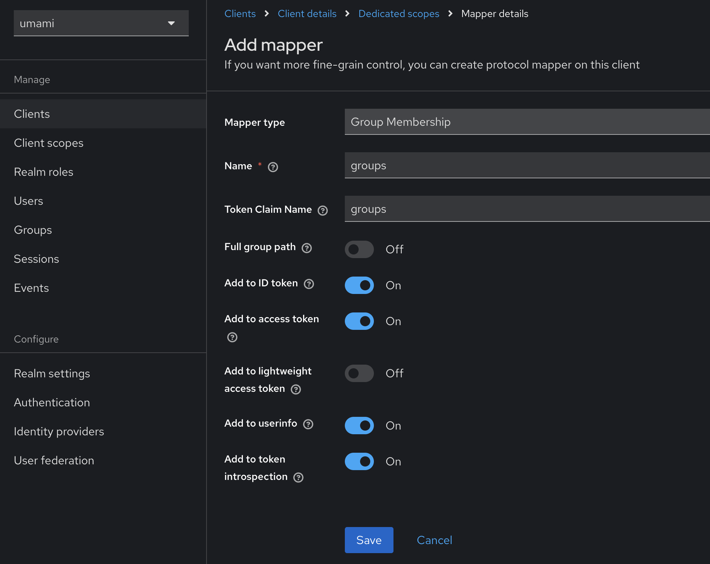

7. Click **Save**

> **✅ Success:** You should now see the `groups` mapper in the mappers list for `umami-dedicated` scope.

Your `umami-dedicated` scope should now have the groups mapper configured:

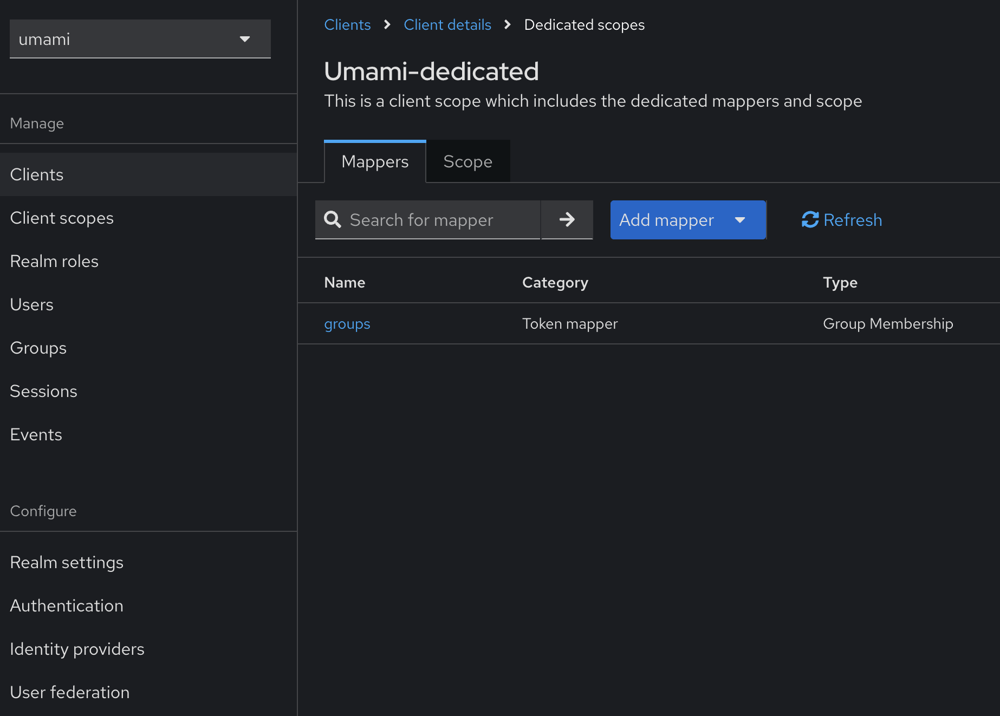

---

### Step 7: Verify Email Claim

The `email` scope should already be configured by default. Let's verify it's enabled.

1. **Navigate back to Client scopes tab:**
   - Click **Clients** in the left sidebar
   - Click your `umami` client
   - Click the **Client scopes** tab

2. In the **Assigned client scopes** section, verify `email` is present and set to **Default**:

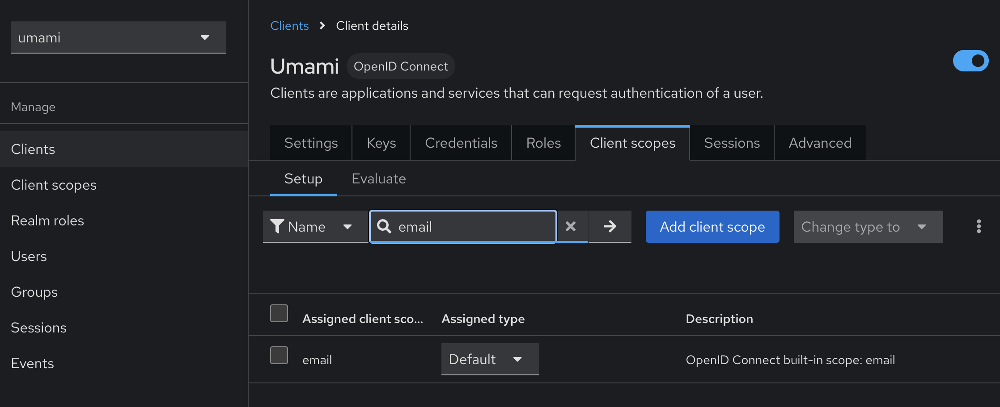

**What you're seeing:** The table shows all client scopes assigned to this client. Each scope has an **Assigned type** dropdown with two options:
- **Default** - Always included in tokens (recommended for email and profile)
- **Optional** - Only included when explicitly requested

> **Note:** If `email` is missing, click **Add client scope**, select `email`, and set the **Assigned type** to **Default**. If it shows **Optional**, change the dropdown to **Default**.

---

### Step 8: Verify Profile Claims

The `profile` scope provides user name information.

1. From the **Client scopes** tab (same location as Step 7), verify `profile` is in **Assigned client scopes** and set to **Default**

> **Note:** If `profile` is missing, click **Add client scope**, select `profile`, and set the **Assigned type** to **Default**. If it shows **Optional**, change the dropdown to **Default**.

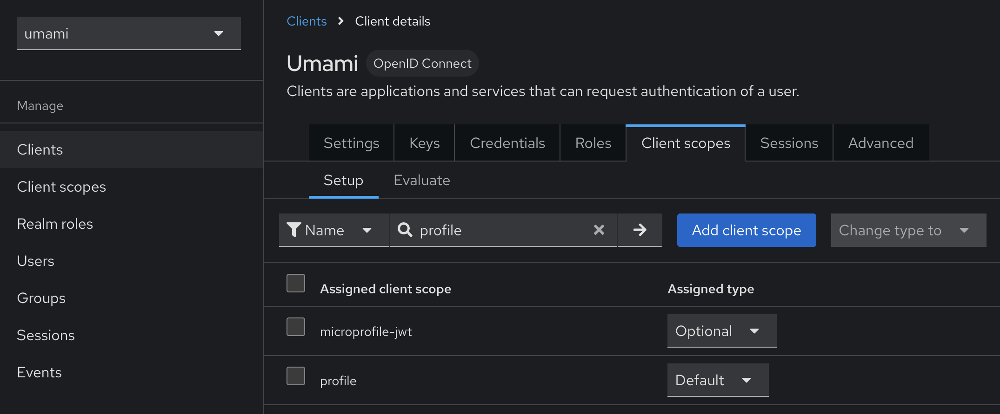

---

### Step 9: Review Client Scopes Configuration

**Summary of what we configured:**
- ✅ Groups mapper in `umami-dedicated` scope → enables role mapping
- ✅ Email scope assigned → provides user email (required)
- ✅ Profile scope assigned → provides user name/username

---

## Part 3: Retrieve Client Credentials

### Step 10: Get Client ID and Client Secret

You'll need both the Client ID and Client Secret to configure Umami.

#### Client ID

1. In the left sidebar, click **Clients**
2. Click on your `umami` client
3. On the **Settings** tab, find the **Client ID** field at the top
4. Copy the value (e.g., `umami` - the same value you entered in Step 2)

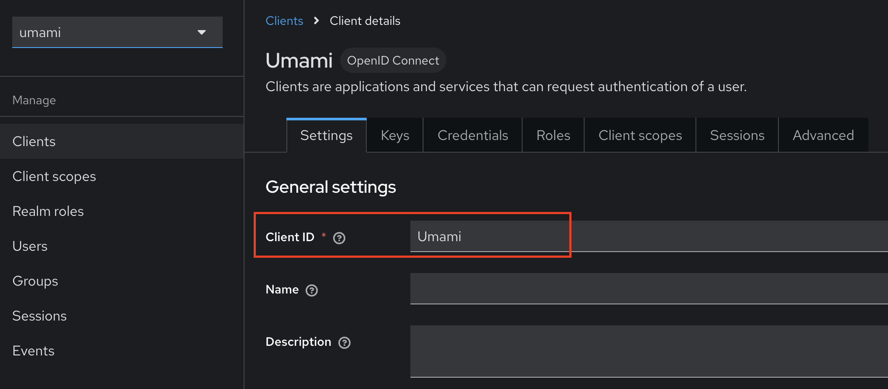

#### Client Secret

1. From the same client page, click the **Credentials** tab
2. Copy the **Client secret** value

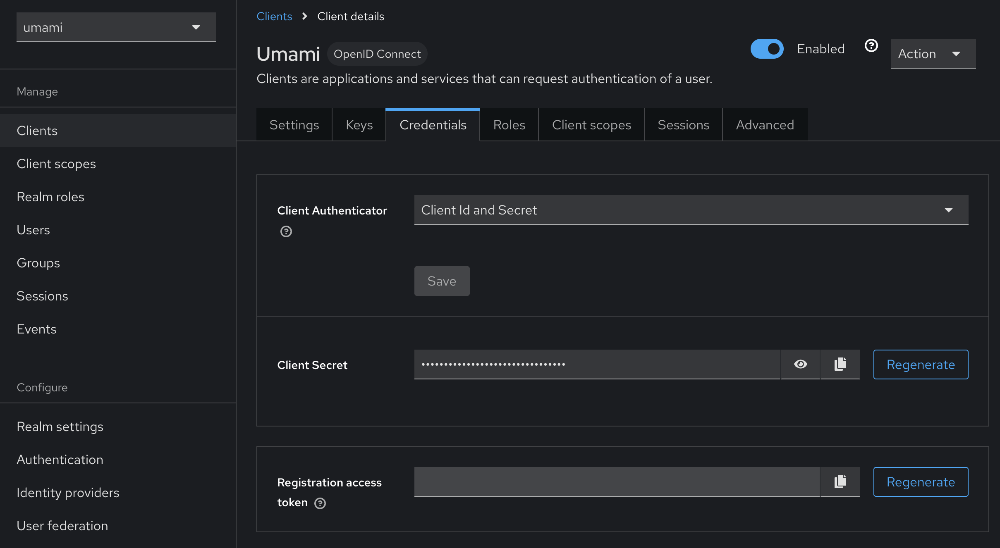

> ⚠️ **Important:** Keep this secret secure! You'll need both values when configuring Umami (Step 13).

---

### Step 11: Get Issuer URL

The issuer URL format is:
```
https://{KEYCLOAK_HOST}/realms/{REALM_NAME}
```

**Examples:**
- `https://auth.example.com/realms/master`
- `https://keycloak.company.com/realms/umami-realm`
- `http://localhost:8080/realms/master` (local development)

You can verify by navigating to:
```
https://auth.example.com/realms/master/.well-known/openid-configuration
```

This should return a JSON document with OIDC discovery information.

---

## Part 4: Create Groups and Users (Optional)

### Step 12: Create Groups for Role Mapping

If you want to use Umami's role mapping feature (admin/view-only):

1. Navigate to **Groups** in the left sidebar
2. Click **Create group**
3. Create these groups:

| Group Name | Umami Role |
|------------|------------|
| `umami-admins` | Admin (full access) |
| `umami-viewers` | View-only (read-only) |

4. For team sync, create additional groups (e.g., `analytics-team`, `marketing-team`)

### Step 13: Assign Users to Groups

1. Navigate to **Users**
2. Select a user
3. Go to **Groups** tab
4. Click **Join Group**
5. Select group (e.g., `umami-admins`)
6. Click **Join**

---

## Part 5: Configure Umami

### Step 14: Add Provider in Umami

#### Option A: Via Admin UI (Recommended)

1. Log in to Umami as admin
2. Navigate to **Settings** → **Providers**
3. Click **Add Provider**
4. Fill in the form:

| Field | Value |
|-------|-------|
| **Name** | `Keycloak SSO` |
| **Type** | `oidc` |
| **Client ID** | `umami` (from Step 2) |
| **Client Secret** | (from Step 10) |
| **Issuer URL** | `https://auth.example.com/realms/master` (from Step 11) |
| **Trusted Provider** | ✓ Checked (for enterprise Keycloak) |
| **Admin Group** | `umami-admins` (optional, from Step 12) |
| **View-Only Group** | `umami-viewers` (optional, from Step 12) |
| **Team Mappings** | See [Team Sync Configuration](#team-sync-configuration) below |

5. Click **Save**

After saving, you'll see the provider details page. Note the **Callback URL** shown at the top:

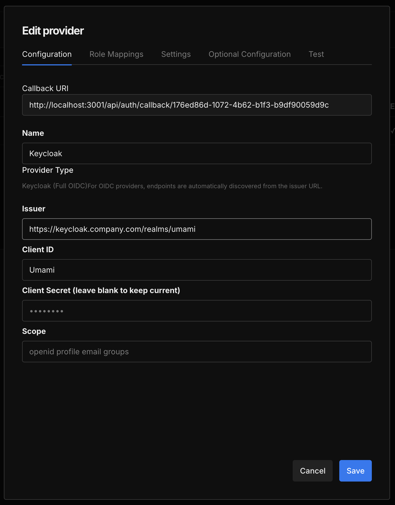

This is the exact redirect URI you'll need to configure in Keycloak (next step).

#### Option B: Via Environment Variables

Add to `.env`:

```bash
OIDC_CLIENT_ID=umami
OIDC_CLIENT_SECRET=your-client-secret-from-step-8
OIDC_ISSUER=https://auth.example.com/realms/master
```

Restart Umami.

---

### Step 15: Update Keycloak Redirect URI

Now that Umami has generated the provider and callback URL, we need to update Keycloak with the exact redirect URI.

1. Copy the **Callback URL** from Umami (from Step 14)
   - Format: `https://analytics.example.com/api/auth/callback/{provider-id}`
   - Example: `https://analytics.example.com/api/auth/callback/cm123abc456`

2. Go back to Keycloak admin console
3. Navigate to **Clients** → `umami` client
4. Click **Settings** tab
5. In **Valid redirect URIs**, replace the wildcard with the exact callback URL from Umami:
   - Remove: `https://analytics.example.com/api/auth/callback/*`
   - Add: `https://analytics.example.com/api/auth/callback/cm123abc456` (use your actual callback URL)

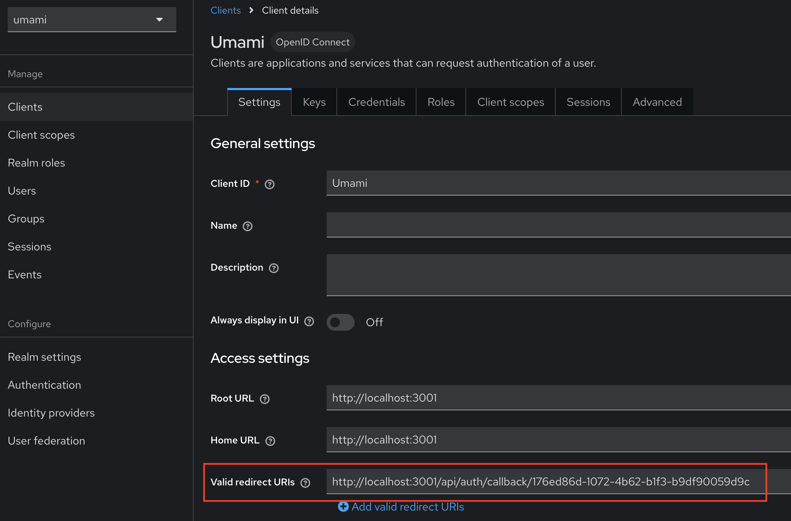

6. Click **Save**

> **Security Note:** Using the exact callback URL (instead of a wildcard) is more secure as it prevents redirect URI hijacking attacks.

---

## Part 6: Role Mapping & Team Sync

Umami can automatically assign roles and team memberships based on Keycloak group claims. Configure these in the **Role Mappings** tab when adding or editing the provider in Umami's admin UI.

### Understanding Umami Roles

| Role | Permissions |
|------|-------------|
| **Admin** | Full access: manage users, teams, websites, and providers |
| **View-only** | Read-only access to all websites and dashboards |
| **User** | Default role: can access websites they're assigned to |

### How It Works

On every login, Umami:
1. Reads the `groups` claim from the Keycloak ID token
2. Checks if the user is in the **Admin Group** → assigns `role = admin`
3. Else checks if the user is in the **View-Only Group** → assigns `role = view-only`
4. Otherwise → assigns `role = user` (default)

**Priority:** Admin > View-only > User

> **Important:** Roles are re-evaluated on every login, so changes in Keycloak groups take effect immediately on next login.

### Configure Role Mapping

In Umami, edit the Keycloak provider and go to the **Role Mappings** tab:

| Field | Value | Description |
|-------|-------|-------------|
| **Admin Group** | `umami-admins` | Keycloak group name for admin users |
| **View-Only Group** | `umami-viewers` | Keycloak group name for read-only users |

> **Note:** These must exactly match the group names created in Keycloak (Step 10). Group matching is case-sensitive. Keycloak group names may include a leading `/` (e.g., `/umami-admins`) — use the name without the slash.

### Verifying Group Claims

To verify Keycloak is sending the `groups` claim correctly:

1. Log in via Keycloak
2. Decode the ID token at https://jwt.io
3. Look for the `groups` field:

```json
{
  "sub": "abc123",
  "email": "user@example.com",
  "groups": ["/umami-admins", "/analytics-team"]
}
```

If the `groups` claim is missing, ensure you configured the `groups` client scope (Step 5-7).

### Team Sync Configuration

To automatically add users to Umami teams based on Keycloak groups, use the **Team Mappings** field in the same **Role Mappings** tab:

1. Create teams in Umami (via **Settings** → **Teams**)
2. Note each team's ID (from URL: `/admin/teams/{team-id}`)
3. Enter Team Mappings as JSON:

```json
{
  "analytics-team": "abc123-team-id-uuid",
  "marketing-team": "def456-team-id-uuid"
}
```

**How it works:**
- **Key:** Keycloak group name (from `groups` claim)
- **Value:** Umami team ID (UUID)
- User in Keycloak group `analytics-team` → added to Umami team `abc123-...`
- User leaves Keycloak group → removed from Umami team on next login
- Manual team memberships (`source: 'manual'`) are preserved

---

## Part 7: Advanced Configuration

### Custom Scopes

If you need additional claims, add custom scopes in Keycloak:

1. Go to **Client scopes** → **Create client scope**
2. Add custom mappers (e.g., `department`, `employee_id`)
3. Assign scope to `umami` client
4. In Umami provider settings, set **Scope** field:
   ```
   openid email profile groups department
   ```

### Session Lifetime

By default, Keycloak sessions last 30 minutes. To change:

1. Go to **Realm settings** → **Tokens** tab
2. Adjust **SSO Session Idle** and **SSO Session Max**

In Umami, control session duration via environment variable:
```bash
SESSION_DURATION=7200  # 2 hours in seconds
```

---

## Testing the Integration

### Test Login Flow

1. Log out of Umami
2. Navigate to Umami login page
3. You should see a **Sign in with Keycloak SSO** button
4. Click it → redirected to Keycloak login
5. Enter Keycloak credentials → redirected back to Umami
6. ✅ You should be logged in

### Verify User Creation

1. Log in as admin
2. Go to **Settings** → **Users**
3. Verify the OIDC user was created with:
   - Email from Keycloak
   - Correct role (based on group membership)

### Verify Role Mapping

1. Log in with a user in `umami-admins` group
2. Check **Settings** → **Users**
3. Verify user has **Admin** role

### Verify Team Sync

1. Log in with a user in a mapped group (e.g., `analytics-team`)
2. Go to **Settings** → **Teams**
3. Click the team → verify user appears in members list

### Check Audit Logs

1. Go to **Settings** → **Audit Logs**
2. Verify login event shows:
   - Action: `login`
   - Provider: `keycloak`
   - User email
   - IP address

---

## Troubleshooting

### "Invalid redirect_uri"

**Cause:** Redirect URI in Keycloak doesn't match Umami's callback URL.

**Solution:**
1. Check Keycloak client → **Valid redirect URIs**
2. Should be: `https://analytics.example.com/api/auth/callback/keycloak`
3. Ensure exact match (no trailing slash, correct protocol)

### "User not found" or "Email is required"

**Cause:** Email claim missing from ID token.

**Solution:**
1. In Keycloak, go to **Client scopes** → `email`
2. Click **Mappers** → `email` mapper
3. Ensure **Add to ID token** is `ON`
4. Verify user has an email address set in Keycloak

### Groups not working

**Cause:** Groups claim not present in ID token.

**Solution:**
1. Verify group mapper exists (Step 5)
2. Check **Add to ID token** is `ON`
3. Verify user is actually in the groups in Keycloak
4. Test by decoding the ID token at https://jwt.io

### "Client authentication failed"

**Cause:** Client secret mismatch.

**Solution:**
1. In Keycloak: **Clients** → `umami` → **Credentials**
2. Copy the current client secret
3. Update in Umami provider settings
4. Save and retry

### HTTPS/SSL errors

**Cause:** Keycloak using self-signed certificate or HTTP in production.

**Solution:**
- **For production:** Use valid SSL certificate
- **For development:** Can use HTTP (`http://localhost:8080`)
- Check Keycloak's `sslRequired` realm setting

### Logout not working

**Cause:** Post logout redirect URI not configured.

**Solution:**
1. In Keycloak client settings → **Login settings**
2. Add to **Valid post logout redirect URIs**: `https://analytics.example.com/login`

> **Important:** Always include `/login` at the end - this is where users land after logout completes.

---

## OIDC Logout Behavior

### Full SSO Logout (Implemented) ✅

Keycloak supports **RP-initiated logout**, allowing Umami to terminate both the local session and the Keycloak SSO session.

When users click "Logout" in Umami:

1. Umami clears its own JWT session cookie
2. Umami redirects to Keycloak's `end_session_endpoint`:
   ```
   https://keycloak.example.com/realms/{realm}/protocol/openid-connect/logout
   ?id_token_hint=<user_id_token>
   &post_logout_redirect_uri=https://analytics.example.com/login
   ```
3. Keycloak terminates the SSO session
4. Keycloak redirects user back to the **Valid post logout redirect URI** (your Umami login page)

**Result:** User is logged out from **both** Umami and Keycloak completely. Next login will require re-authentication.

### Logout Flow Diagram

```
┌─────────────┐
│ User clicks │
│   Logout    │
└──────┬──────┘
       │
       ▼
┌──────────────────────────┐
│ Umami clears JWT cookie  │
└──────┬───────────────────┘
       │
       ▼
┌────────────────────────────────────────────────┐
│ Redirect to Keycloak end_session:              │
│ /realms/{realm}/protocol/openid-connect/logout │
│ ?id_token_hint=<token>                         │
│ &post_logout_redirect_uri=/login               │
└──────┬─────────────────────────────────────────┘
       │
       ▼
┌────────────────────────────┐
│ Keycloak invalidates       │
│ SSO session                │
└──────┬─────────────────────┘
       │
       ▼
┌─────────────────────────────────────┐
│ Redirect to Valid post logout URI:  │
│ https://analytics.../login          │
└─────────────────────────────────────┘
```

###  Credentials vs OIDC Logout

| Login Method | Logout Behavior |
|--------------|-----------------|
| **Local credentials** | Clears Umami session → redirects to login page |
| **OIDC (Keycloak)** | Clears Umami session → logs out from Keycloak → redirects to login page |

**Note:** If you log in with credentials (username/password), logout only clears the Umami session. OIDC logout is only triggered for users who logged in via SSO.

### Back-Channel Logout (Optional)

Keycloak also supports **back-channel logout** - where Keycloak can notify Umami when a user logs out from a different application sharing the same Keycloak session.

**How it works:**
1. User logs out from App A (not Umami)
2. Keycloak sends a POST request with a signed `logout_token` to Umami's back-channel endpoint
3. Umami revokes the user's session

**Current status:** Not implemented in Umami yet. This is a low-priority enterprise feature - useful only if you have multiple applications sharing Keycloak sessions and need instant cross-app logout.

**To enable (future):** Would require implementing `/api/auth/backchannel-logout` endpoint in Umami and configuring **Backchannel logout URL** in Keycloak client settings.

### Testing Logout

1. Log in to Umami via Keycloak SSO
2. Click the profile menu → **Logout**
3. ✅ You should be redirected to Keycloak briefly
4. ✅ Then automatically redirected back to Umami's login page
5. ✅ Try logging in again — Keycloak should prompt for credentials (not auto-login)

**Expected behavior:**
- Umami session is cleared
- Keycloak SSO session is terminated
- User must re-authenticate on next login

**If Keycloak auto-logs you in immediately:**
- Verify **Valid post logout redirect URIs** is configured in Keycloak client settings
- Check that `id_token` is being stored in the session (should happen automatically)
- Review Keycloak realm **Sessions** to ensure session was actually terminated

---

## Security Considerations

### 1. Use Client Secret Securely

- Store client secret in environment variables, not in code
- In Umami, secrets are encrypted at rest (AES-256-GCM)
- Rotate secrets periodically

### 2. Restrict Redirect URIs

Only add the exact callback URL needed:
```
https://analytics.example.com/api/auth/callback/keycloak
```

Avoid wildcards like `https://analytics.example.com/*`.

### 3. Enable MFA in Keycloak

1. **Realm settings** → **Authentication**
2. Configure OTP (TOTP) or WebAuthn
3. Require for admin users in `umami-admins` group

### 4. Review Token Lifetimes

Balance security vs UX:
- Access token: 5-15 minutes
- Refresh token: 30-60 minutes
- SSO session: 1-8 hours

### 5. Monitor Failed Logins

In Keycloak:
- **Realm settings** → **Login**
- Enable brute force detection

In Umami:
- Review audit logs at `/admin/audit`

---

## Advanced: Keycloak as Identity Broker

You can configure Keycloak to broker other IdPs (Google, Azure AD, GitHub):

1. **Identity providers** → **Add provider**
2. Configure upstream IdP
3. Users can sign in via upstream provider through Keycloak
4. Umami sees all users as coming from Keycloak (simplified config)

This allows centralized user management while supporting multiple authentication sources.

---

## Next Steps

- **[Configuration Guide](../configuration.md)** - Learn about team sync and role mapping
- **[Features](../features.md)** - Explore all OIDC features
- **[Audit Logs](../configuration.md#step-7-verify-configuration)** - Monitor authentication events
- **Keycloak Documentation:** https://www.keycloak.org/docs/latest/
